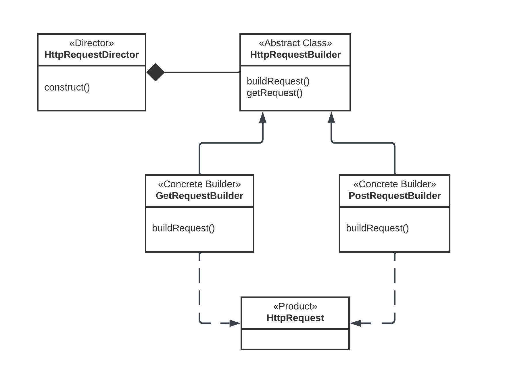

# Builder Design Pattern Demo

## Overview

This project demonstrates the **Builder design pattern** in C#. The Builder pattern is a creational design pattern that separates the construction of a complex object from its representation. It allows for the step-by-step construction of a complex object, providing flexibility and control over the construction process.

## Real World Application

The Builder pattern is beneficial in scenarios where an object requires multiple steps to create, especially when certain steps can have variations. Some real-world examples include:

- Document Generation Systems: document generation system where users can create custom documents with different fonts, styles
- Game Character Creation: In video games, players often have the option to customize their characters with different attributes, skills, and appearance

## Project Structure

The project consists of the following components:

- **HttpRequestBuilder**: Defines an abstract contract for building an HTTP request. Contains abstract methods for setting method, URL, version, headers, and body.
  
- **GetRequestBuilder**: Concrete builder class for constructing a GET HTTP request.

- **PostRequestBuilder**: Concrete builder class for constructing a POST HTTP request.

- **HttpRequest**: Represents an HTTP request with properties for method, URL, version, headers, and body.

- **HttpRequestDirector**: Orchestrates the construction of an HTTP request using a builder. Allows setting a specific builder and constructing the request.

- **HttpRequestBuilderTests**: Contains unit tests for testing the construction of GET and POST HTTP requests using the builder pattern.

## Usage

To use the builder pattern for creating HTTP requests, follow these steps:

1. Create an instance of `HttpRequestDirector`.

2. Select a specific builder (either `GetRequestBuilder` or `PostRequestBuilder`).

3. Set the builder in the director.

4. Construct the request using the director.

5. Get the constructed request using `GetRequest()`.

## Environment

The project is built and tested on Visual Studio Community 2022. Ensure that the required workloads are installed for successful building and execution.

## How to Run

1. Open the solution in Visual Studio.

2. Set the desired project as the startup project.

3. Build and run the project.

## Contributing

Feel free to open issues or submit pull requests for any improvements or suggestions.

## License

This project is licensed under the [MIT License](LICENSE).

---

*Author: Shubhang kedia*

*Project: Builder Design Pattern Demo*
